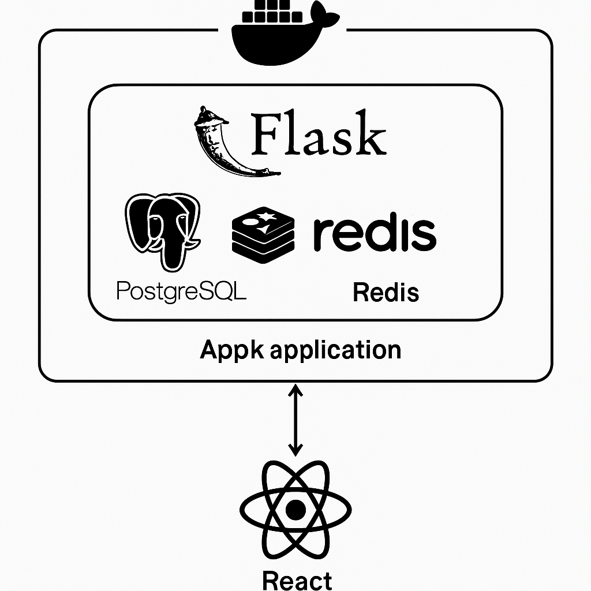

# 🧩 Proyecto Fullstack: Flask + React + PostgreSQL + Redis

Aplicación fullstack con backend en Flask y frontend en React. Permite registro y autenticación de usuarios, creación y gestión de mensajes personales, y control de acceso mediante roles. Está lista para despliegue moderno con Docker, migraciones y CI/CD.

---

## 🚀 Arquitectura General

- **Frontend:** React 18 (planificado uso de Tailwind CSS)
- **Backend:** Flask (API REST)
- **Base de datos:** PostgreSQL (compatible con Neon)
- **Cache:** Redis
- **Autenticación:** JWT (Flask-JWT-Extended)
- **Migraciones:** Alembic (con Flask-Migrate)
- **Contenerización:** Docker y Docker Compose

---

## 📦 Estructura del Proyecto

```
proyecto-uno/
├── src/
│   ├── __init__.py
│   ├── models.py
│   ├── main_routes.py
│   ├── admin_routes.py
│   └── project_routes.py
├── manage.py
├── requirements.txt
├── docker-compose.yml
├── .env
├── .env.example
└── README.md
```

---

## ⚙️ Instalación y Uso Rápido

1. **Clona el repositorio:**
    ```bash
    git clone https://github.com/tuusuario/proyecto-uno.git
    cd proyecto-uno
    ```

2. **Configura el entorno:**
    ```bash
    cp .env.example .env
    # Edita las credenciales de DB y JWT según tu entorno
    ```

3. **Levanta los servicios backend:**
    ```bash
    docker-compose up -d --build
    ```

4. **Inicializa la base de datos (primer uso):**
    ```bash
    docker-compose exec web flask db init
    docker-compose exec web flask db migrate -m "Inicial"
    docker-compose exec web flask db upgrade
    ```

5. **(Opcional) Corre el frontend:**
    ```bash
    cd frontend/
    npm install
    npm run dev
    ```

---

## 🔒 Autenticación y Roles

- **Registro y login** con JWT.
- **Roles**: admin y usuario.
- Rutas protegidas con token (`Authorization: Bearer <token>`).

---

## 🧪 Endpoints API (Ejemplo)

- `POST /api/register` – Registra un usuario
- `POST /api/login` – Devuelve token JWT
- `POST /api/mensajes` – Crea mensaje (autenticado)
- `GET /api/mis-mensajes` – Lista mensajes del usuario
- `PUT/DELETE /api/mensajes/:id` – Edita/borra mensaje propio
- `GET/PUT/DELETE /api/usuarios/:id` – Acciones admin

---

## 🌱 Beneficios y Ventajas

- **Modularidad:** Backend con Blueprints y frontend desacoplado.
- **Escalabilidad:** Redis para caché y Alembic para migraciones.
- **Seguridad:** JWT y roles para control de acceso.
- **Práctico para despliegues:** Dockerizado y portable a producción (Neon, AWS, etc).

---

## 👨‍💻 Autor

Desarrollado por **Javier Ferreira**  
Analista Programador TI – experiencia en backend, despliegue, monitoreo (Zabbix), orquestación (Airflow, Docker).

---

## 📝 Notas

- **No subas tu archivo `.env` real. Usa `.env.example` para compartir configuraciones.**
- Revisa la documentación y scripts en `src/` para detalles avanzados.

---

## 🚧 Roadmap

- Dashboard de estadísticas (pendiente)
- Mejoras en administración de usuarios
- Despliegue frontend en Vercel/EC2
- CI/CD con GitHub Actions

---

¡Bienvenido/a a bordo! Si tienes dudas, revisa issues o abre un nuevo ticket.

# 🧩 Fullstack Project: Flask + React + PostgreSQL + Redis

A fullstack application with a Flask backend and React frontend. Provides user registration, JWT authentication, personal message creation/management, and role-based access control. Designed for modern deployment with Docker, migrations, and CI/CD.

---

## 🚀 Architecture Overview

- **Frontend:** React 18 (Tailwind CSS planned)
- **Backend:** Flask (REST API)
- **Database:** PostgreSQL (Neon-compatible)
- **Cache:** Redis
- **Authentication:** JWT (Flask-JWT-Extended)
- **Migrations:** Alembic (with Flask-Migrate)
- **Containerization:** Docker and Docker Compose

---

## 📦 Project Structure

```
proyecto-uno/
├── src/
│   ├── __init__.py
│   ├── models.py
│   ├── main_routes.py
│   ├── admin_routes.py
│   └── project_routes.py
├── manage.py
├── requirements.txt
├── docker-compose.yml
├── .env
├── .env.example
└── README.md
```

---

## ⚙️ Quick Start

1. **Clone the repository:**
    ```bash
    git clone https://github.com/youruser/proyecto-uno.git
    cd proyecto-uno
    ```

2. **Set up environment variables:**
    ```bash
    cp .env.example .env
    # Edit DB and JWT credentials as needed
    ```

3. **Start backend services:**
    ```bash
    docker-compose up -d --build
    ```

4. **Initialize the database (first time only):**
    ```bash
    docker-compose exec web flask db init
    docker-compose exec web flask db migrate -m "Initial"
    docker-compose exec web flask db upgrade
    ```

5. **(Optional) Start the frontend:**
    ```bash
    cd frontend/
    npm install
    npm run dev
    ```

---

## 🔒 Authentication & Roles

- **Register and login** with JWT.
- **Roles:** admin and user.
- Protected routes require a token (`Authorization: Bearer <token>`).

---

## 🧪 API Endpoints (Examples)

- `POST /api/register` – Register user
- `POST /api/login` – Get JWT token
- `POST /api/mensajes` – Create message (authenticated)
- `GET /api/mis-mensajes` – List user’s messages
- `PUT/DELETE /api/mensajes/:id` – Edit/delete own message
- `GET/PUT/DELETE /api/usuarios/:id` – Admin actions

---

## 🌱 Key Features

- **Modularity:** Decoupled backend (Blueprints) and frontend.
- **Scalability:** Redis for cache, Alembic for migrations.
- **Security:** JWT and role-based access.
- **Deployment-ready:** Dockerized, portable (Neon, AWS, etc).

---

## 👨‍💻 Author

Developed by **Javier Ferreira**  
IT Analyst Programmer – backend, deployment, monitoring (Zabbix), orchestration (Airflow, Docker).

---

## 📝 Notes

- **Never commit your real `.env`. Use `.env.example` for sharing configs.**
- Check code and scripts in `src/` for more details.

---

## 🚧 Roadmap

- Stats dashboard (coming soon)
- Enhanced user management
- Frontend deploy to Vercel/EC2
- CI/CD with GitHub Actions

---

Welcome! If you have questions, check issues or open a new ticket.

## 🗺️ Architecture Diagram


